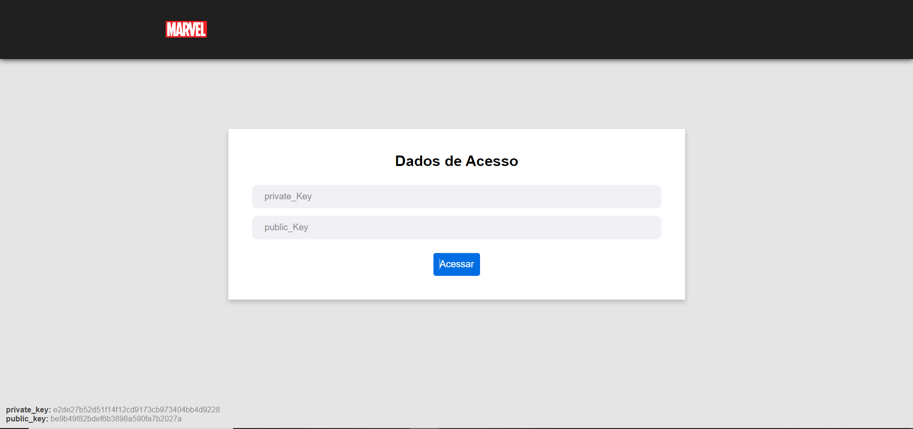
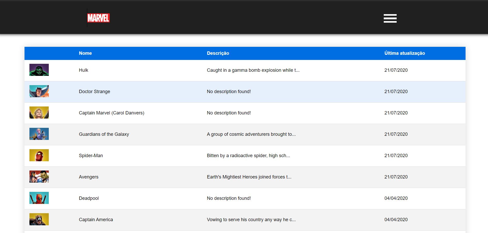
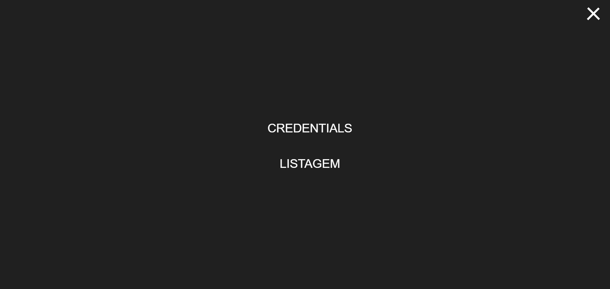
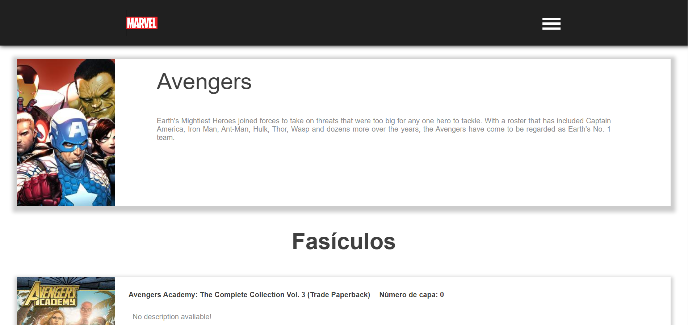

# Mavel Characters

## About

An aplication created to search characters of Marvel. Using the API ([https://developer.marvel.com/docs](https://developer.marvel.com/docs))

## Demonstration

[marvel-buriti.netlify.app](marvel-buriti.netlify.app)

## :rocket: Technologies Used

- [React](https://pt-br.reactjs.org/)
- [Redux](https://redux.js.org/)
- [Redux Saga](https://redux-saga.js.org/)
- [Axios](https://github.com/axios/axios)
- [Styled components](https://styled-components.com/)
- [webpack](https://webpack.js.org/)
- [babel](https://babeljs.io/)
- [eslint](https://eslint.org/)
- [prettier](https://prettier.io/)

## Pages & Menu

#Credential page
the user need to enter whith the public and private key provided by the Marvel developer site, the keys are validated and if they are correct the user is directed to the home screen.

  

#Home Page
The list of characters are displayed on a table with pagination

  

#Menu
An responvivle menu with navigation to the credentials screen and Home screen

  

#Description Page
On the Description screen you can see the description with image and comics that the character participated(with pagination)

  

After cloned the project (git clone https://bitbucket.org/epburiti/marvel.git) use the command:

### `yarn`

For the installation of the project facilities (package.json).

At the root of the project, use the command:

### `yarn dev`

This will start the development server at the address [http://localhost:8080](http://localhost:8080)

To use the system in production use the command:

### `yarn build`

This will start the production server.
